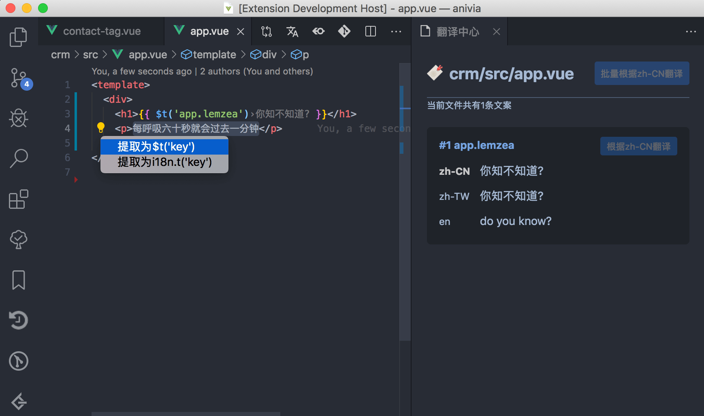
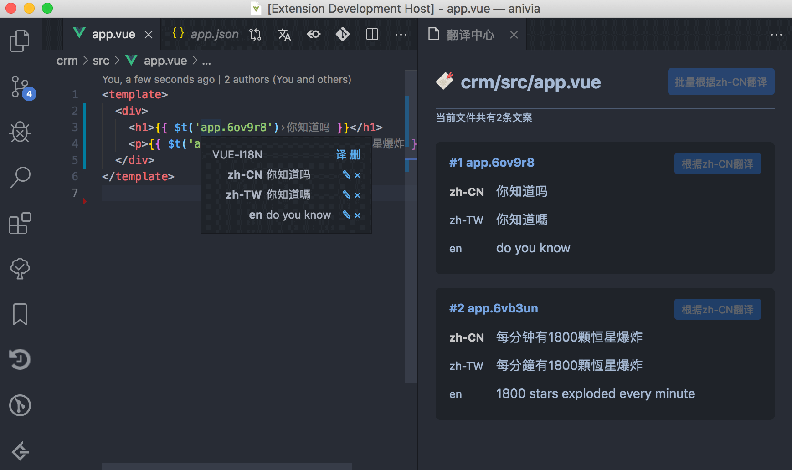
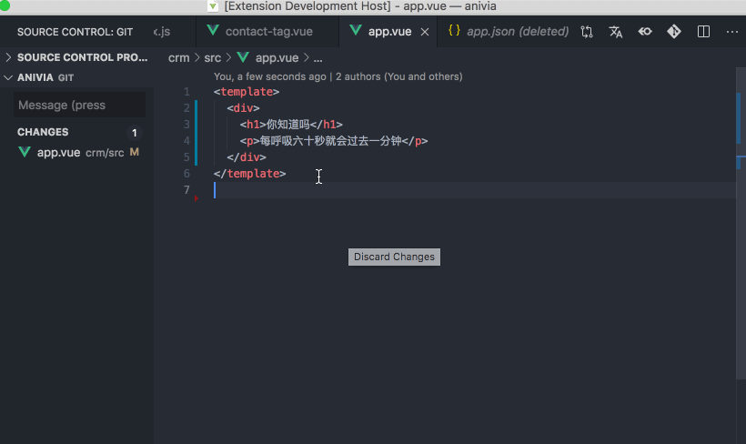

<p align="center">

</p>
<h1 align="center">vscode-vue-i18n</h1>

<p align="center">
<a href="https://marketplace.visualstudio.com/items?itemName=think2011.vue-i18n"></a>
<a href="https://marketplace.visualstudio.com/items?itemName=think2011.vue-i18n"></a>
<a href="https://marketplace.visualstudio.com/items?itemName=think2011.vue-i18n"></a>
</p>


<p align="center">
为什么要做这个插件？因为写 i18n 真的很啰嗦很麻烦啊 😫
</p>

<p align="center">
这个插件能够帮到你方便查看和编写 vue-i18n 🎉
</p>

<h2 align="center"> ⚡ 主要功能 </h2>

### 提取并自动翻译文案 (快捷键 ⌘+.)


### 直观的看到对应的翻译文案


### 通过翻译中心管理翻译



<h2 align="center"> 🦉 如何使用? </h2>

### 1. 首先你的目录应该是类似这样的结构

```
  locales 
  ├── en.json
  ├── zh-CN.json
  ├── zh-TW.json
  ├── ...
  └── <contry-code>.json
```

或者

```
  locales
  ├── en
  |   ├── common.json
  |   ├── buttons.json
  |   ├── ...
  |   └── <filenames>.json
  ├── zh-CN
  |   ├── common.json
  |   ├── buttons.json
  |   └── ...
  └── <contry-code>
      ├── common.json
      ├── buttons.json
      └── ...
```

### 2. 那么安装好插件后就会自动识别目录了

> 如果不是的话，那请执行如图的命令吧 😝


## 📆 功能列表

- [x] 翻译提示
- [x] 翻译注释
- [x] 翻译中心
- [x] 删除多个语言
- [x] google、youdao、baidu在线翻译
- [x] 字段补全
- [x] 自动配置翻译目录
- [x] 手动配置翻译目录
- [x] 可指定翻译源语言
- [x] 重复、覆盖检测
- [ ] 快捷跳转到对应翻译文件
- [ ] 翻译率提示

## 👏特别感谢

谢谢你帮忙完善了插件

- @antfu
- @lanten

> ✨同时也推荐功能更为强大的 [vue-i18n-ally@antfu](https://github.com/antfu/vue-i18n-ally)

## QA

> 怎么安装？

在 `vscode` 插件里搜索 `react-i18n`，或者点击上上方的小徽章安装吧！

> 怎么不开 Issues?

估计很长一段时间里都比较忙，而且懒，如果你遇到了**实在难以解决的问题**或者非要~~提需求~~ **吐槽**，那你给我发封邮件吧 <452125301.hzplay@gmail.com>，要是可以贡献 PR 那真的太棒了 🙂